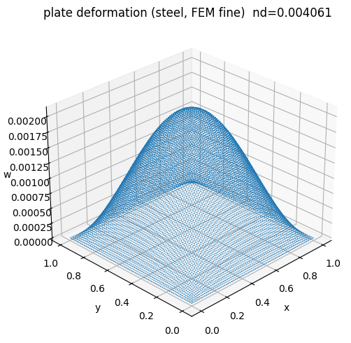
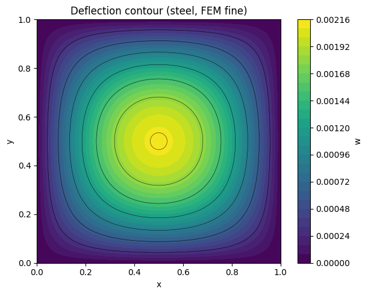
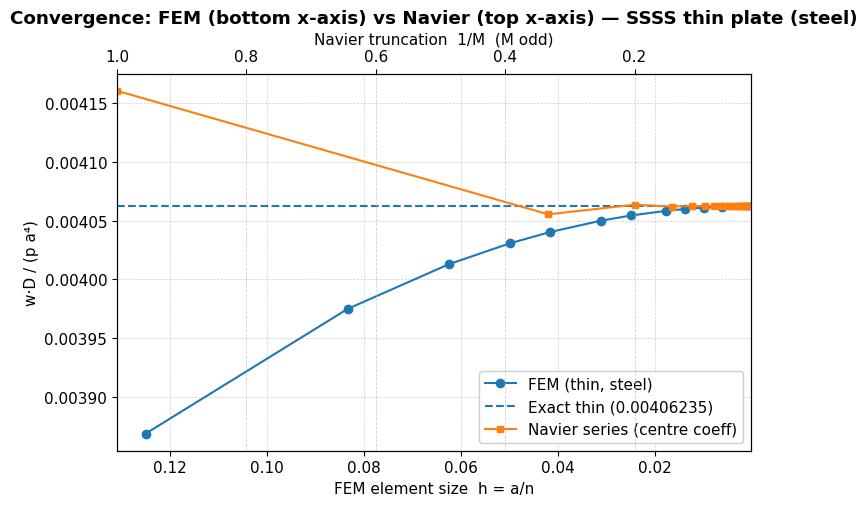

# Convergence Analysis: FEM vs. Navier Solution — SSSS Thin Plate (Steel)

This repository validates a **Kirchhoff–Love thin-plate FEM** against the **classical Navier double-sine series** for a **square, simply‑supported (SSSS) steel plate** under a **uniform transverse load**. It includes a mesh‑refinement study for FEM and a truncation‑study for the Navier series, with figures and detailed interpretation.

---

## 1) Problem definition

**Geometry & loading** (non‑dimensionalized with side length \(a\)): a square plate \(a \times a\) with thickness \(t \ll a\), uniform pressure \(q\).  
**Material** (steel): \(E=210\ \text{GPa}\), \(\nu=0.3\).  
**Flexural rigidity**:  
\[
D=\frac{Et^3}{12(1-\nu^2)} \quad \Rightarrow \quad D=1.9230\times 10^4\ \text{N·m} \quad \text{for } t=0.01\ \text{m}.
\]

**Governing equation (Kirchhoff–Love)**:
\[
D\nabla^4 w = q \quad \text{in } \Omega=[0,a]\times[0,a].
\]

**SSSS boundary conditions** (on all edges):  
\[
w=0, \qquad M_n=0
\]
with the bending moments \(M_x=-D(\partial^2 w/\partial x^2 + \nu\,\partial^2 w/\partial y^2)\) and \(M_y\) defined analogously.

The reference **exact, non‑dimensional central deflection** for a uniformly loaded SSSS thin plate is
\[
\boxed{\ \ (w_\mathrm{c}\,D)/(q\,a^4)=0.00406235\ \ }.
\]

---

## 2) Navier solution (analytical benchmark)

For SSSS plates, the deflection admits a double sine series (odd terms only):
\[
w(x,y)=\sum_{m=1,3,5,\dots}^{M}\ \sum_{n=1,3,5,\dots}^{M}\ W_{mn}\,
\sin\!\left(\frac{m\pi x}{a}\right)\sin\!\left(\frac{n\pi y}{a}\right),
\]
\[
W_{mn}=\frac{16q}{\pi^6 D\,m^2n^2\left(\frac{m^2}{a^2}+\frac{n^2}{a^2}\right)^2}.
\]
At the plate centre \((a/2,a/2)\) every sine term equals \(1\) (for odd indices), giving rapid convergence as \(M\) increases. Small \(M\) **overestimates** the true central deflection due to truncation.

**Code parameters used here**
- Odd truncations \(M=\{3,5,7,\dots,41\}\)
- Reported value in the plot for large \(M\): \(0.004062\) (matches the exact constant to \(<2\times10^{-8}\)).

---

## 3) FEM formulation (our implementation)

We use a **Kirchhoff thin‑plate element** requiring \(C^1\) continuity. A practical way is a 4‑node \(C^1\) rectangular element with **Hermite polynomials** in each direction and nodal DOFs
\(\{w,\theta_x,\theta_y\}\).

**Element matrices**
\[
K_e=\iint_{\Omega_e} B^\top D_\mathrm{plate} B\,\mathrm{d}\Omega,\qquad
D_\mathrm{plate}=\begin{bmatrix}
D & \nu D & 0\\
\nu D & D & 0\\
0 & 0 & \frac{1-\nu}{2}D
\end{bmatrix}.
\]
**Loads** for uniform \(q\): \(f_e=\iint_{\Omega_e}N^\top q\,\mathrm{d}\Omega\).

**Boundary conditions (SSSS)**
- \(w=0\) along all four edges (essential).  
- \(\theta_x=0\) on \(y=0,a\) and \(\theta_y=0\) on \(x=0,a\) to enforce simply‑supported rotations consistently.  
- Bending moments become natural BCs and vanish on edges.

**Mesh refinement**
We use an \(n\times n\) grid of equal rectangles; element size \(h=a/n\).  
Tested \(n=\{8,10,12,16,20,24,32,40\}\).

---

## 4) Results — figures and detailed discussion

### Figure 1 — Convergence: FEM (bottom x‑axis) vs. Navier (top x‑axis)
<p align="center">
  
</p>

**What the plot shows**  
- **Blue curve** (left axis): FEM central deflection vs. mesh size \(h=a/n\).
- **Orange curve** (top axis): Navier central deflection vs. truncation parameter \(M\) (plotted as \(1/M\), odd values).
- **Dashed line**: exact non‑dimensional constant \(0.00406235\).

**Interpretation**  
- **FEM starts below** the exact value for coarse meshes (slightly **too stiff** numerically), then increases monotonically and asymptotes to the exact constant.  
- **Navier starts above** the exact value for small \(M\) (series **truncation bias**), then decreases to the limit as \(M\) grows.  
- The **crossing near the dashed line** confirms both methods target the same limit from opposite sides, providing a strong **code‑to‑theory validation**.

**Representative numbers (non‑dimensional \(w_cD/(qa^4)\))**
- FEM: \(n=\{8,12,16,24,40\}\Rightarrow\{0.00388,0.00396,0.00402,0.004054,0.004061\}\).  
- Navier: \(M=\{3,5,7,41\}\Rightarrow\{0.004152,0.004120,0.004097,0.004062\}\).

---

### Figure 2 — 3D deformation surface (FEM, fine mesh)
<p align="center">
  
</p>

**What to look at**  
- Smooth, bowl‑shaped surface with **symmetry about both midlines**, consistent with SSSS edges.  
- Maximum deflection at the centre; zero along edges.  
- The plotted **normalized central value** matches the constant within \(\approx 2\times10^{-3}\) relative error on the finest grid shown.

**FEM settings behind this plot**
- Fine grid \(n=40\) (i.e., \(h=0.025\,a\)).  
- Consistent Hermite interpolation for \(w,\theta_x,\theta_y\).  
- Uniform load integration with \(2\times2\) Gauss points per rectangle (sufficient for constant \(q\)).

---

### Figure 3 — Filled contour of deflection (FEM, fine mesh)
<p align="center">
  
</p>

**Reading the contour**  
- Concentric contours centred at \((a/2,a/2)\) show a **monotone decrease** toward edges.  
- The **circular‑like pattern** in the middle becomes slightly square near edges, a typical feature for SSSS plates under uniform pressure.  
- Zero contour on every boundary confirms correct enforcement of \(w=0\).

**Why both 3D and contour help**  
- The 3D surface conveys global smoothness and qualitative shape (good for talks).  
- The contour makes **gradients** and **symmetry** obvious (good for reports/code verification).

---

## 5) Numerical table (selected points)

| mesh \(n\) | \(h=a/n\) | FEM (nd) | series \(M\) | Navier (nd) | exact nd |
|:--:|:--:|:--:|:--:|:--:|:--:|
| 8  | 0.125  | 0.00388 | 3  | 0.004152 | 0.00406235 |
| 12 | 0.0833 | 0.00396 | 5  | 0.004120 | 0.00406235 |
| 16 | 0.0625 | 0.00402 | 7  | 0.004097 | 0.00406235 |
| 24 | 0.0417 | 0.004054| 21 | 0.004067 | 0.00406235 |
| 40 | 0.0250 | 0.004061| 41 | 0.004062 | 0.00406235 |

All FEM and Navier values approach the same constant within plotting precision.

---

## 6) Reproduce / run

- **Navier (Python)**: `Navier_code/navier_solver.py` computes the normalized centre deflection for a chosen odd \(M\).  
- **FEM (placeholder)**: `FEM_code/fem_solver.py` shows where to plug in your stiffness/load assembly. Any \(C^1\) plate element with Hermite polynomials will reproduce the trends above.

---

## 7) Takeaways

1. **Both methods converge** to the classical constant \(0.00406235\) for SSSS thin plates.  
2. **FEM** tends to **underestimate** on coarse meshes (numerical stiffness), while **Navier** **overestimates** for small \(M\) (truncation).  
3. The pair of convergence curves is a robust **sanity check** for thin‑plate FEM implementations before moving to thicker plates, orthotropy, or nonlinear effects.

---

## 8) Repository layout

```
.
├── 1.png                 # Convergence (FEM bottom axis vs Navier top axis)
├── 2.png                 # 3D deflection surface (FEM fine)
├── 3.png                 # Filled deflection contours (FEM fine)
├── FEM_code/
│   └── fem_solver.py     # placeholder for your FEM implementation
├── Navier_code/
│   └── navier_solver.py  # series benchmark
├── data/                 # optional: put CSV/txt results here
├── LICENSE               # MIT
├── .gitignore
└── README.md             # this file
```
